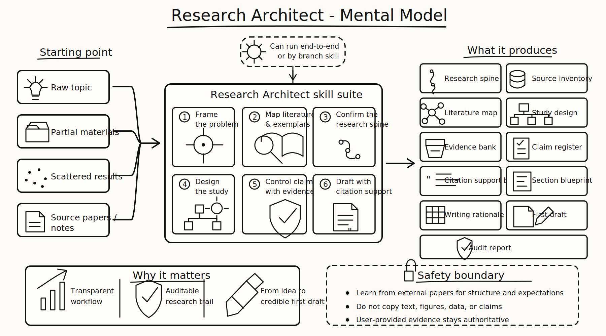

# Research Architect Skill Suite

[English](README.md) | 简体中文

**Research Architect** 是一套用于科研选题、研究设计和论文写作的 workflow skill suite。它的核心设计是学习参考文献的研究思路：从参考文献中提炼选题思路，判断题目难度，明确 research gap，定义创新点，设计 study components，组织证据，并把零散材料收束成清晰的论文主线。

## Mental model



Research Architect 可以端到端运行，也可以按阶段调用。核心思想是保留从原始想法到 research spine、study design、evidence、claim、citation support、draft 和 audit 的透明轨迹。

## Quick start

安装后先运行：

```text
research-architect
```

示例任务：

```text
I have a broad idea: genetic regulation in lung cancer.
I also have two target reference papers I want to learn from.
Use Research Architect to extract their research logic, propose feasible
research-question options, and build an adapted research spine.
```

## 核心思路

Research Architect 的核心方法是：**把目标参考文献作为研究设计样本，拆解其 research logic、证据结构和论证功能，再围绕你的课题生成可执行的 adaptation plan、study design、证据组织和论文主线。**

这里的“对标参考文献”关注研究结构：一篇好论文如何提出问题、缩小范围、定义 gap、选择 design family、安排比较或 warrant、组织 evidence displays，并让每个 claim 获得恰当证据或引用支撑。

## 它解决的核心困境是

- 文献读了很多，选题思路仍然停留在大方向；
- 研究问题看起来重要，具体 gap 仍然模糊；
- 创新点有了，却缺少有力的证据链支撑；
- 实验结果已经存在，却难以转化为一个完整的故事；
- 图表不知道展示哪些数据，缺少清晰的叙事功能；
- claim 写得很强，证据强度还停留在 association 或 observation；
- 参考文献被放进 introduction，却没有真正指导 study design。

## 工作流

```text
原始想法
  -> 目标参考文献逻辑拆解
  -> 参考文献到用户课题的 adaptation plan
  -> 选题思路与 research gap
  -> research spine
  -> study design
  -> study component 与分析计划
  -> evidence bank
  -> claim register
  -> citation support bank
  -> evidence display map
  -> section blueprint 与 writing rationale matrix
  -> 初稿
  -> 审计与修改队列
```

## 如何从参考文献中学习研究设计

Research Architect 会把参考文献当作“科研设计范例”来拆解，重点分析：

- 文献如何提出 problem；
- 文献如何缩小选题范围；
- 文献如何控制研究难度；
- 文献如何定义 research gap；
- 文献如何提出创新点；
- 文献如何把创新点转化为适合本研究范式的 study design；
- 文献如何安排 comparison、counterfactual、negative case、warrant 或 validation；
- 文献如何组织 figures、tables、quotation matrices、case maps、conceptual models 等 evidence displays；
- 文献如何把结果转化为有边界的 claim；
- 文献如何用引用和证据支撑论文叙事。

## 如何帮助形成选题思路

Research Architect 会把选题过程拆成一组可回答的问题：

1. 这个方向对应哪一类 design family？
2. 参考文献已经建立了哪些共识？
3. 当前领域还留下哪些可切入的 gap？
4. 哪个 gap 更适合当前阶段的数据、技术、时间和资源条件？
5. 当前题目的难度来自数据、方法、验证、理论，还是写作结构？
6. 创新点来自新问题、新数据、新方法、新组合、新验证方式，还是更清晰的 evidence framework？
7. 主要 claim 需要哪些证据、分析、比较或 warrant 来支撑？
8. 哪些材料适合作为核心 evidence displays，哪些适合作为补充材料？

## 如何帮助设计研究

Research Architect 会把参考文献中的设计逻辑转化为适合当前课题的 study design。它会帮助规划 study components、analysis plan、comparison 或 warrant、negative case、credibility check、threats to validity、evidence displays 和 claim-strength boundary。

## 如何帮助定义创新点

Research Architect 会把“创新点”拆成更具体的类型，例如更清晰的问题、新的数据组合、新的分析流程、已有方法的新应用场景、更严格的 benchmark、更可信的 validation、更清楚的 evidence hierarchy，或把分散思路整合成可复用 framework。

## 输出结果

一次完整运行会在 `paper_output/` 下留下完整的研究构建轨迹，包括 research spine、source inventory、literature map、exemplar logic profile、exemplar adaptation plan、study design、analysis plan、study component registry、evidence bank、claim register、evidence display map、citation support bank、writing rationale matrix、manuscript draft 和 audit report。`experiment_registry.md` 和 `figure_asset_map.md` 仍作为兼容 artifact 支持，但新的通用名称是 `study_component_registry.md` 和 `evidence_display_map.md`。

## 安装方式

从仓库根目录运行以下命令。Codex 的实际安装目录是 `${CODEX_HOME:-$HOME/.codex}/skills`。

**Codex:**

```bash
CODEX_SKILLS_DIR="${CODEX_HOME:-$HOME/.codex}/skills" && mkdir -p "$CODEX_SKILLS_DIR" && cp -R dist/codex/skills/. "$CODEX_SKILLS_DIR/"
```

**Claude Code:**

```bash
CLAUDE_SKILLS_DIR="${CLAUDE_HOME:-$HOME/.claude}/skills" && mkdir -p "$CLAUDE_SKILLS_DIR" && cp -R dist/codex/skills/. "$CLAUDE_SKILLS_DIR/"
```

也可以使用 release artifact：

```bash
mkdir -p "${CODEX_HOME:-$HOME/.codex}" && tar -xzf release/research-architect-codex-skills.tar.gz -C "${CODEX_HOME:-$HOME/.codex}"
```

安装后调用主 skill：

```text
research-architect
```

也可以在只需要某个阶段时直接调用 branch skills。

## 仓库结构和 source of truth

`src/` 是唯一源头：

- `src/skills/` 保存 skill definitions；
- `src/references/` 保存共享参考资料；
- `src/templates/` 保存输出模板；
- `src/scripts/` 保存验证、索引和 release 构建脚本。

## Evaluation

Reference-adaptation fixtures 位于 `evals/reference_adaptation/`。先验证 fixture contract：

```bash
python src/scripts/check_reference_adaptation_fixtures.py
```

再对生成的 artifact bundle 评分：

```bash
python src/scripts/run_reference_adaptation_eval.py \
  --generated-root eval_runs/reference_adaptation/generated \
  --output-dir eval_runs/reference_adaptation/latest
```

该 deterministic harness 会评分 extraction coverage、adaptation validity、design-family fit、actionability、claim control 和 copying-risk control。单个 fixture 需要达到 85/100 且没有 critical failures 才算通过。

## 使用边界

参考文献的作用是提供研究结构、problem framing、方法逻辑、实验顺序、证据标准和写作组织方式。用户自己的数据、实验结果、分析输出和证据材料始终是论文内容的基础。Research Architect 会根据证据强度控制 claim 的表达，让论文主张与实际材料保持一致。

## License

本项目使用 MIT License。详见 [LICENSE](LICENSE)。

## Changelog

后续版本会继续扩展 executable skill evals、validation 覆盖范围，并调整 skill descriptions，让 Codex 和 Claude 更稳定地路由到正确的 branch skill。详见 [CHANGELOG.md](CHANGELOG.md)。

## 更新说明

`v0.3.1` 已发布。本次更新增加 deterministic reference-adaptation eval harness，可根据四个 fixture contract 对生成的 artifact bundle 评分，并补充单元测试、pass threshold 文档和重新构建的 Codex release artifact。

`v0.3.0` 将目标参考文献设为 workflow 的一等输入，并增加 exemplar logic profile、adaptation plan、design-family routing 以及通用的 study/evidence artifacts。
