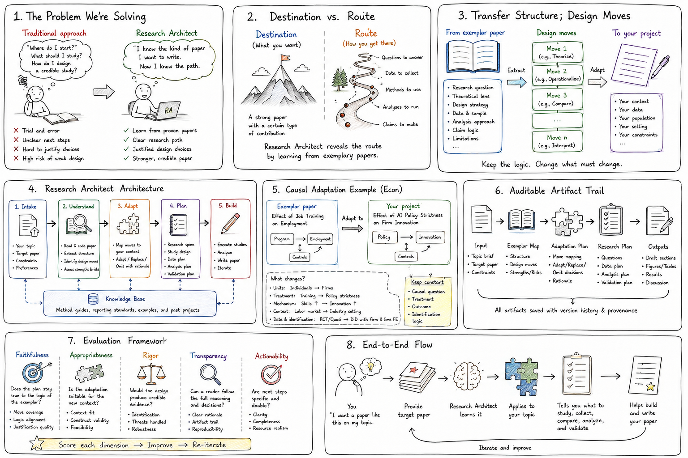

# Research Architect Skill Suite

English | [简体中文](https://github.com/mmTheBest/Research-Architect)

**Research Architect** is a research workflow skill suite for moving from a raw topic, partial materials, or scattered results to a coherent research-paper draft.

It provides an end-to-end research workflow for building a study from scratch: selecting a research question, conducting a focused literature review, identifying the research gap, designing the study, organizing evidence, controlling claims, planning figures, managing citation support, and drafting an auditable manuscript. The skill turns early-stage research ideas into a structured, reproducible path from brainstorming to a credible first draft.

## Mental model



Research Architect can run end-to-end or one branch at a time. The core idea is simple: preserve a transparent trail from raw idea to research spine, study design, evidence, claims, citation support, draft, and audit.

## Quick start

After installation, start with:

```text
research-architect
```

Example task:

```text
I have a broad idea: genetic regulation in lung cancer.
Use Research Architect to propose feasible research-question options,
then help me choose one and build the research spine.
```

## Core idea

Research Architect helps you learn research design from reference papers. It decomposes strong papers into reusable research structure: how they frame a problem, narrow scope, define the gap, set up experiments, choose baselines and controls, organize figures, and keep each claim within its evidence boundary.

The goal is to transfer the research logic behind good papers into your own project without copying their text, figures, data, results, citation choices, or claims.

## Problems it addresses

- You have read many papers but still only have a broad topic.
- The direction sounds important, but the concrete research gap is unclear.
- The contribution can be described, but the evidence chain is weak.
- The topic keeps expanding and the experiment scope becomes hard to control.
- Results exist, but the paper story is loose.
- Figures look like result dumps instead of argument-bearing evidence.
- Claims are stronger than the design supports.
- References appear in the introduction but do not actually guide study design.

## Workflow

```text
Raw idea
  -> Literature and exemplar mapping
  -> Research-question options and research gap
  -> Research spine
  -> Study design
  -> Experiment and analysis plan
  -> Evidence bank
  -> Claim register
  -> Citation support bank
  -> Section blueprint
  -> First draft
  -> Audit and revision queue
```

## How it learns from reference papers

Research Architect treats references as research-design examples. It analyzes:

- how a paper frames the problem;
- how it narrows the topic;
- how it controls difficulty;
- how it defines the research gap;
- how it expresses contribution;
- how contribution becomes study design;
- how baselines, controls, ablations, and validation are arranged;
- how figures are organized;
- how results become bounded claims;
- how citations and evidence support the manuscript narrative.

## How it helps form research-question options

Research Architect pushes a broad topic into concrete research judgment by asking:

1. What research paradigm does this direction belong to?
2. What has prior work already established?
3. Which gaps remain open and answerable?
4. Which gap fits the available data, methods, time, and resources?
5. Does difficulty come from data, method, validation, theory, or writing structure?
6. Does the contribution come from a new question, dataset, method, combination, validation strategy, or evidence framework?
7. What experiments, analyses, and controls are needed for the central claim?
8. Which results belong in main figures and which belong in supplementary material?

## How it helps design studies

Research Architect converts the design logic learned from references into a project-specific study design. It helps plan core experiments, baselines, controls, ablations, robustness checks, validation experiments, failure cases, threats to validity, evaluation metrics, and claim-strength boundaries.

## How it helps define contribution

Research Architect breaks "contribution" into more concrete types, such as a clearer research question, a new data combination, a new analysis workflow, a new application context for an existing method, a stricter benchmark, more credible validation, a clearer evidence hierarchy, or a reusable framework that integrates scattered ideas.

## Outputs

A complete run leaves a transparent trail under `paper_output/`, including research spine, source inventory, literature map, study design, analysis plan, experiment registry, evidence bank, claim register, citation support bank, writing rationale matrix, manuscript draft, and audit report.

## Installation

Run one of these commands from the repository root. The actual Codex install path is `${CODEX_HOME:-$HOME/.codex}/skills`.

**Codex:**

```bash
CODEX_SKILLS_DIR="${CODEX_HOME:-$HOME/.codex}/skills" && mkdir -p "$CODEX_SKILLS_DIR" && cp -R dist/codex/skills/. "$CODEX_SKILLS_DIR/"
```

**Claude Code:**

```bash
CLAUDE_SKILLS_DIR="${CLAUDE_HOME:-$HOME/.claude}/skills" && mkdir -p "$CLAUDE_SKILLS_DIR" && cp -R dist/codex/skills/. "$CLAUDE_SKILLS_DIR/"
```

You can also install from the release artifact:

```bash
mkdir -p "${CODEX_HOME:-$HOME/.codex}" && tar -xzf release/research-architect-codex-skills.tar.gz -C "${CODEX_HOME:-$HOME/.codex}"
```

After installation, call the main skill as:

```text
research-architect
```

Branch skills can also be called directly when only one stage is needed.

## Repository layout and source of truth

`src/` is the single source of truth:

- `src/skills/` stores skill definitions;
- `src/references/` stores shared reference material;
- `src/templates/` stores output templates;
- `src/scripts/` stores validation, indexing, and release-building scripts.

## Safety boundary

External papers are used to learn structure, problem framing, method logic, experiment sequencing, evidence standards, and writing organization. User-provided data, results, analyses, and evidence remain authoritative. Research Architect calibrates claim language to the strength of the available evidence.

## License

This project is released under the MIT License. See [LICENSE](../LICENSE).

## Changelog

Future versions will add skill evals, expand validation, and tune skill descriptions so Codex and Claude route to the right branch skill more reliably. See [CHANGELOG.md](../CHANGELOG.md).
